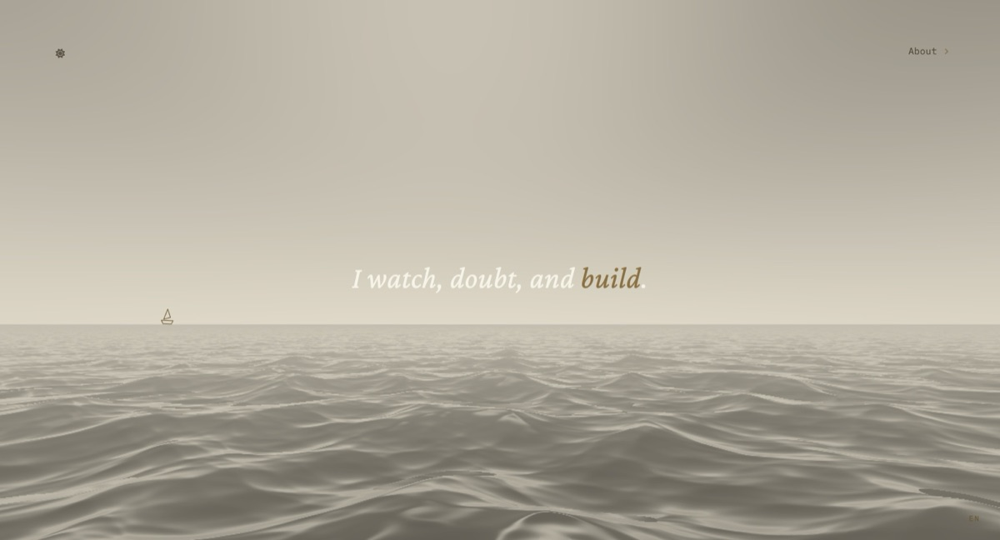

# Rhine Tague — Portfolio



> I watch, doubt, and build.

A portfolio built as a place rather than a page: a full-viewport WebGL ocean under a
day/night sky, with the work opening as paper letters over water that never restarts.

Live: **[lesz25.com](https://lesz25.com)**

---

## What's here

- **Work** — causal AI, companion-agent runtimes, observational interfaces.
- **Research** — preprints and white papers.
- **Photography** — six albums, shot across Switzerland, Paris, and the Philippines.
- **Archive** — field notes. Currently: *What My Hands Knew First*.
- **Purpose** — the ground under the work.

## The ocean

A raymarched WebGL sea (based on afl_ext's *Ocean*, MIT) retuned to a warm two-tone
palette. Day and night are one shader: the entire palette resolves from two anchor
colours in a duotone post-process, so the two themes are the same geometry seen under
different light.

**Day** — an Interstellar-warm sea: cream sky, sun-path glints, clear water.
**Night** — a Milky Way band overhead, and bioluminescent plankton blooms lighting the
crests of breaking waves.

A boat sails the horizon — purely atmospheric.

## Stack

Vanilla — no framework. Vite, WebGL2, ES modules. Five languages (EN/DE/FR/IT/ZH).

```bash
npm install
npm run dev     # localhost:5174
npm run build
```

## Credits

The atmosphere — a raymarched ocean under a day/night sky, with content opening as
letters over water that never restarts — was inspired by
[Armin Roncher](https://github.com/mitsuhiko)'s [earendil.com](https://earendil.com).
No code from that site was used; the shader, palette, structure, and content here are
Rhine's own, built from scratch in this repo.

Ocean shader based on [afl_ext](https://www.shadertoy.com/user/afl_ext)'s *Ocean* (MIT).

## Licence

Apache 2.0.
